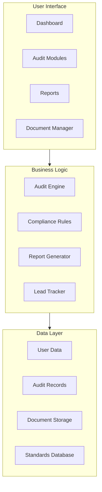
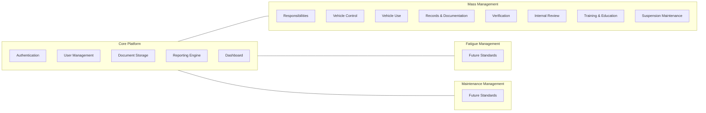
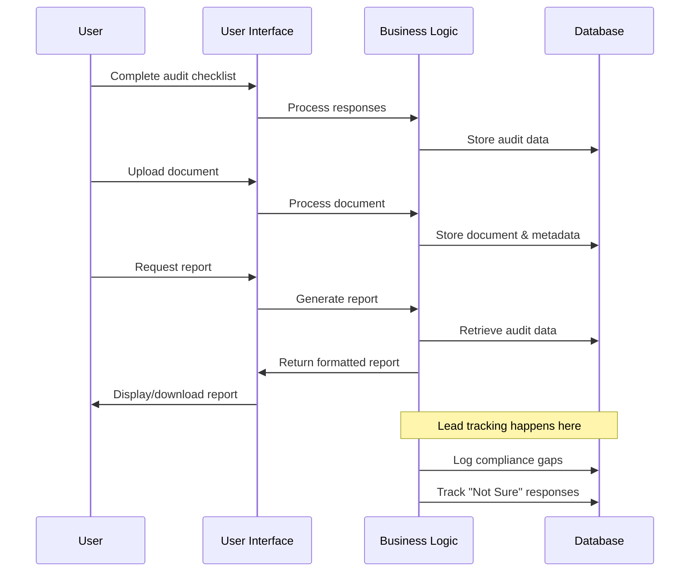

# System Patterns

## Architecture Overview
The Mass Management Accreditation Self-Audit Tool will be built as a web-based application with a modular architecture that can accommodate future expansion to other NHVAS modules (Fatigue Management and Maintenance Management). The system is designed to be both user-friendly for transport operators and valuable for compliance consultants.



## Key Components

### 1. User Interface Layer
- **Dashboard**: Central hub showing audit progress, pending tasks, and compliance status across all active modules
- **Audit Modules**: Separate interfaces for each NHVAS module (Mass Management, with future expansion to Fatigue and Maintenance)
- **Reports**: Exportable audit reports and compliance summaries with historical tracking
- **Document Manager**: Interface for uploading, organizing, and cross-referencing evidence documents

### 2. Business Logic Layer
- **Audit Engine**: Core logic for processing audit responses and tracking progress
- **Compliance Rules**: Rules engine implementing NHVAS standards and requirements for each module
- **Report Generator**: Creates standardized reports from audit data
- **Lead Tracker**: Identifies and tracks potential consulting opportunities based on user responses

### 3. Data Layer
- **User Data**: Stores user profiles, preferences, and authentication information
- **Audit Records**: Maintains history of audits, responses, and compliance status
- **Document Storage**: Centralized repository for evidence documents with metadata and cross-references
- **Standards Database**: Contains NHVAS requirements, checklists, and guidance materials for all modules

## Modular Design Pattern

The application follows a modular architecture where each NHVAS module (Mass Management, Fatigue Management, Maintenance Management) is implemented as a separate but integrated component:



### Benefits of Modular Design
- Independent development and testing of each module
- Users can subscribe to only the modules they need
- Easier updates when individual standards change
- Consistent user experience across all modules
- Shared core functionality (authentication, document storage, reporting)

## Design Patterns

### 1. Progressive Disclosure Pattern
To avoid overwhelming users with complex regulatory information:
- Present information in layers, starting with basic requirements
- Provide "Learn More" options for detailed explanations
- Use collapsible sections for examples and best practices

### 2. State Management Pattern
- Track audit progress persistently
- Allow users to save partial audits and resume later
- Maintain audit history for comparison and trend analysis
- Store document references and cross-links

### 3. Repository Pattern
For document management:
- Centralized storage of all evidence documents
- Metadata tagging to link documents to specific standards
- Cross-referencing to use single documents as evidence for multiple standards
- Version control for document updates

### 4. Observer Pattern
For lead generation:
- Monitor user responses for compliance gaps
- Track "Not Sure" selections and failed checks
- Aggregate data for analytics and reporting
- Trigger potential follow-up actions (e.g., automated emails)

## Technical Decisions

### 1. Platform Choice
- Web-based application for cross-platform compatibility
- Responsive design to support desktop and tablet use
- Single-page application (SPA) architecture for better user experience

### 2. Data Storage
- Centralized database for user data, audit records, and document metadata
- Secure cloud storage for document files
- Caching strategy for performance optimization
- Regular backups and data protection measures

### 3. Authentication & Security
- User authentication to protect sensitive business data
- Role-based access control for potential multi-user organizations
- Encryption for data at rest and in transit
- Session management and secure API access

## Integration Points

### 1. Document Management
- Upload interface for evidence documents
- Tagging system to associate documents with standards
- Search functionality to find relevant documents
- Export capabilities for audit evidence packages

### 2. Reporting System
- Customizable report templates
- PDF and spreadsheet export options
- Historical tracking of compliance progress
- Gap analysis highlighting areas needing improvement

### 3. Future Expansion
- API-first approach to allow for potential integration with:
  - Other NHVAS modules (Fatigue Management, Maintenance Management)
  - Broader compliance software platform
  - Fleet management systems (if needed in the future)

## Data Flow



## User Flow

```mermaid
flowchart TD
    Start[Start] --> Register[Register/Login]
    Register --> Dashboard[Dashboard]
    
    Dashboard --> NewAudit[Start New Audit]
    Dashboard --> ContinueAudit[Continue Audit]
    Dashboard --> ViewReports[View Reports]
    Dashboard --> ManageDocs[Manage Documents]
    
    NewAudit --> SelectModule[Select Module]
    SelectModule --> MassManagement[Mass Management]
    SelectModule --> FatigueManagement[Fatigue Management]
    SelectModule --> MaintenanceManagement[Maintenance Management]
    
    MassManagement --> Standards[Complete Standards Checklists]
    Standards --> UploadEvidence[Upload Evidence]
    UploadEvidence --> ReviewResponses[Review Responses]
    ReviewResponses --> GenerateReport[Generate Report]
    
    GenerateReport --> Dashboard
